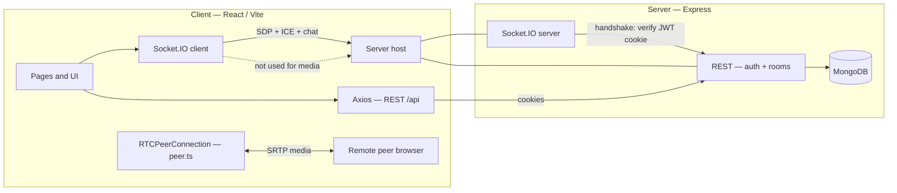
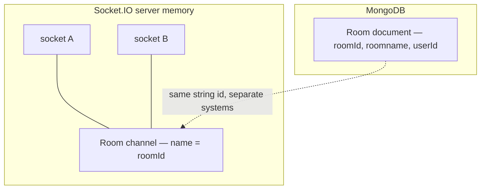
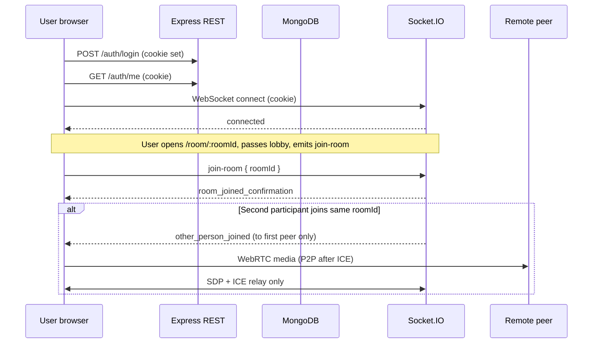
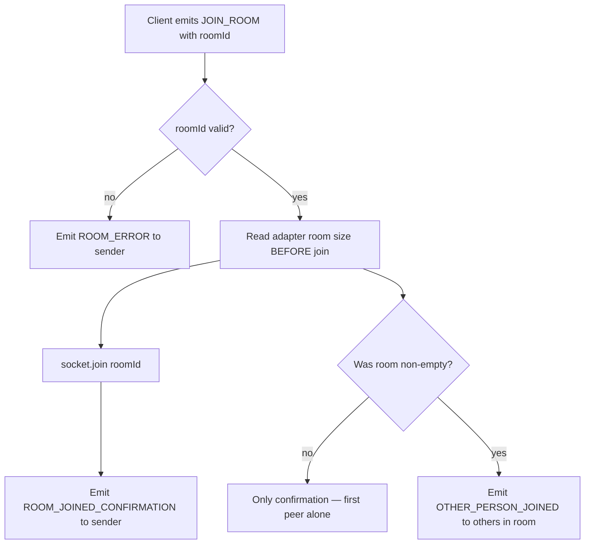
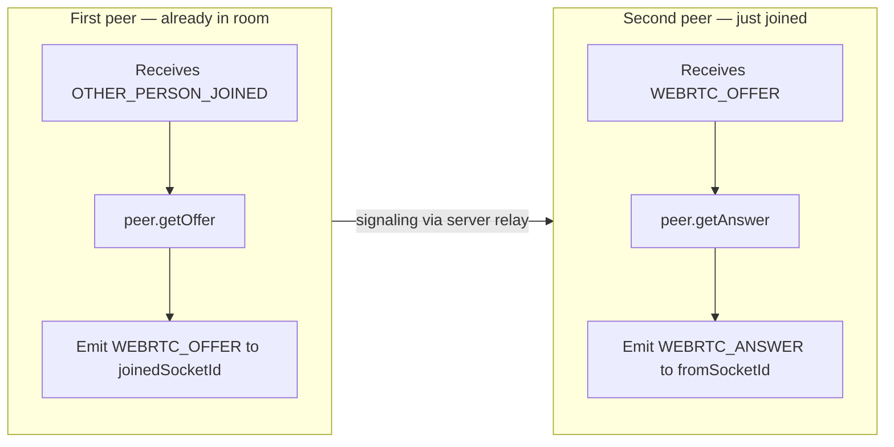
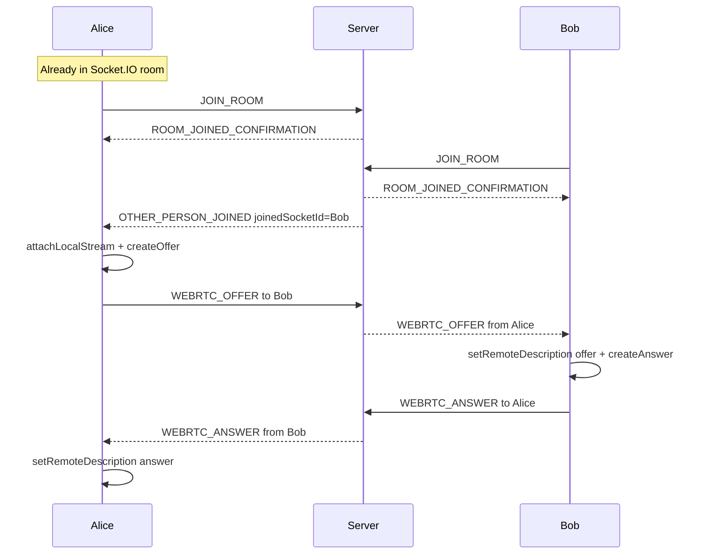
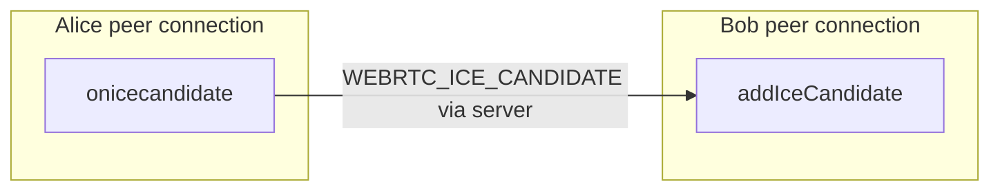
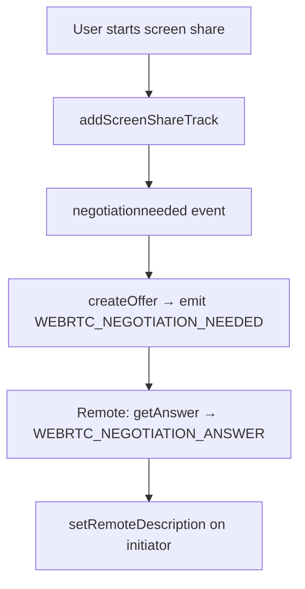

# WebRTC Room Meet

> **Open-source WebRTC video calling** with **Socket.IO signaling**, **React + Vite**, **Express**, **MongoDB**, and **JWT** cookie auth. Includes **1:1** **peer-to-peer** media (**RTCPeerConnection**), **SDP offer/answer**, **ICE** trickle, **screen sharing** with **SDP renegotiation**, and **real-time chat**—useful as a **tutorial**, **starter template**, or **reference** for **Node.js** **WebRTC** apps.

**WebRTC Room Meet** is a full-stack **TypeScript** project: a **browser** client talks to a **signaling server** over **WebSockets** (Socket.IO). The server **does not** proxy audio or video; it forwards **signaling** (session descriptions and ICE candidates) so two browsers can connect **P2P** where possible.

This README explains **how everything fits together**: the difference between a *database room* and a *Socket.IO room*, the order of **socket events**, and how **offers**, **answers**, and **ICE** traverse the server—written for developers searching for a **WebRTC + Socket.IO example**, **Express WebRTC backend**, or **React WebRTC hooks** pattern.

---

## Overview

| What you get | Details |
|--------------|---------|
| **Use cases** | Learn **WebRTC**; ship a **minimal video meeting** UI; copy patterns for **authenticated Socket.IO** and **cookie-based JWT** on the handshake |
| **Media path** | **SRTP** between peers; server handles **SDP**, **ICE**, and **chat** only |
| **Auth model** | **REST** login/register sets an **httpOnly** cookie; **Socket.IO** reuses it |
| **Rooms** | **MongoDB** stores room metadata; **Socket.IO rooms** gate signaling and chat |

### Tech stack

| Layer | Technologies |
|-------|----------------|
| **Client** | **React 19**, **Vite**, **Tailwind CSS**, **socket.io-client**, **Axios**, **TypeScript** |
| **Server** | **Express 5**, **Socket.IO**, **Mongoose** / **MongoDB**, **jsonwebtoken**, **bcrypt**, **Zod** |
| **Realtime** | **Socket.IO rooms**, custom events for **WebRTC signaling** and **chat** |
| **WebRTC** | **RTCPeerConnection**, **getUserMedia**, **getDisplayMedia**, **STUN** (see client `peer.ts`) |

### Who this repository is for

- Developers searching for a **WebRTC signaling server example** (Node / Express).
- Teams evaluating **Socket.IO vs raw WebSockets** for **SDP** and **ICE** exchange.
- Anyone building a **video chat** or **Google Meet–style** prototype with **MongoDB** user accounts.

---

## Repository discoverability and GitHub SEO

Search engines and **GitHub’s own search** use your **repository name**, **short description** (the “About” field), **Topics**, and the **README** text. This section lists practical steps beyond editing the README.

### Suggested GitHub Topics

Add these under **Repository → ⚙ Settings → General → Topics** (or via the main repo page). Topics heavily influence how people find the project on GitHub.

`webrtc` · `socket-io` · `socketio` · `webrtc-signaling` · `react` · `vite` · `express` · `nodejs` · `typescript` · `mongodb` · `mongoose` · `jwt` · `video-chat` · `p2p` · `rtcpeerconnection` · `sdp` · `ice` · `real-time` · `fullstack` · `open-source`

Use as many as apply (GitHub allows multiple topics); avoid irrelevant tags.

### Suggested “About” description (one line)

Use a single line that names the stack and outcome, for example:

*Full-stack WebRTC 1:1 video calls — React, Express, Socket.IO signaling, MongoDB, JWT cookies, screen share & chat (TypeScript).*

### README tips (what helps discovery)

- **Clear H1 + first paragraph**: Already set above—include words people type (**WebRTC**, **Socket.IO**, **React**, **Express**, **signaling**, **video call**).
- **Concrete tech names**: **RTCPeerConnection**, **SDP**, **ICE**, **JWT**, **MongoDB**—match how developers search.
- **Sections with questions**: See [Common questions](#common-questions)—question-style headings align with “how does … work” queries.
- **Unique project name**: Keep the repo name distinctive (e.g. **webrtc-room-meet**) to reduce collision with generic names like `webrtc-app`.

---

## Table of contents

- [Overview](#overview)
- [Tech stack](#tech-stack)
- [Who this repository is for](#who-this-repository-is-for)
- [Repository discoverability and GitHub SEO](#repository-discoverability-and-github-seo)
- [Features](#features)
- [Architecture](#architecture)
- [Repository layout](#repository-layout)
- [Prerequisites](#prerequisites)
- [Configuration](#configuration)
- [Running locally](#running-locally)
- [Concepts: two different “rooms”](#concepts-two-different-rooms)
- [End-to-end lifecycle (high level)](#end-to-end-lifecycle-high-level)
- [Socket.IO: connection and authentication](#socketio-connection-and-authentication)
- [Socket.IO rooms: `join-room` in depth](#socketio-rooms-join-room-in-depth)
- [WebRTC signaling: who sends the offer?](#webrtc-signaling-who-sends-the-offer)
- [Detailed call setup (step by step)](#detailed-call-setup-step-by-step)
- [ICE candidates (after SDP)](#ice-candidates-after-sdp)
- [Screen sharing and renegotiation](#screen-sharing-and-renegotiation)
- [In-call chat](#in-call-chat)
- [Event reference](#event-reference)
- [Limitations and design notes](#limitations-and-design-notes)
- [Common questions](#common-questions)
- [License](#license)

---

## Features

- User **registration / login** with password hashing; **JWT** stored in an **httpOnly** cookie.
- **REST API** to create, list, and delete *room documents* (metadata keyed by a string `roomId`).
- **Socket.IO** with the same cookie for handshake auth; real-time **room membership** for signaling and chat.
- **WebRTC** peer connection per call: **STUN** only in the sample client (`peer.ts`); media is peer-to-peer where possible.
- **1:1** call flow: the **first** peer in a Socket.IO room initiates the **SDP offer** when a **second** peer joins.
- **Screen sharing** via `getDisplayMedia`, adding a video track and using **`negotiationneeded`** → extra SDP round via dedicated socket events.
- **In-call messaging** broadcast to everyone in the Socket.IO room (server enforces “must have joined the room” before sending).

---

## Architecture



**Important:** Audio and video **do not** flow through your Node server. The server relays **signaling messages** (SDP, ICE candidates) and **chat**. The browser sends media **directly** to the other browser once ICE finds a path (STUN/reflexive candidates in this project).

---

## Repository layout

| Path | Role |
|------|------|
| `server/` | Express app, Mongoose models, REST routes, Socket.IO server and handlers |
| `client/` | React SPA, WebRTC hooks, shared `PeerService` singleton, Tailwind UI |

Each package has its own `package.json` and environment files.

---

## Prerequisites

- **Node.js** (LTS recommended)
- **MongoDB** (Atlas or local) — connection URI in server env
- Two browsers or profiles if you want to test **two participants** locally (different users)

---

## Configuration

### Server (`server/.env.development` / `server/.env.production`)

| Variable | Purpose |
|----------|---------|
| `NODE_ENV` | `development` or `production` (selects which `.env.*` file is loaded) |
| `MONGO_URI` | MongoDB connection string (**required**, validated at startup) |
| `JWT_SECRET` | Secret for signing cookies (should be set in production) |

CORS allowed origins are configured in `server/src/config/url.config.ts` (development vs production client URLs).

### Client (`client/.env.development` / `client/.env.production`)

| Variable | Purpose |
|----------|---------|
| `VITE_API_BASE_URL` | Base URL for REST API (e.g. `http://localhost:5000/api`) |
| `VITE_SOCKET_URL` | Origin passed to `io()` for Socket.IO (e.g. `http://localhost:5000`) |

Vite only exposes variables prefixed with `VITE_`.

**Security note:** Do not commit real secrets. Use environment variables or secret managers in CI/production.

---

## Running locally

1. **MongoDB** — ensure `MONGO_URI` is valid.
2. **Server** — from `server/`:

   ```bash
   npm install
   npm run dev
   ```

   Builds TypeScript to `build/` and runs with nodemon (see `server/package.json`).

3. **Client** — from `client/`:

   ```bash
   npm install
   npm run dev
   ```

4. Open the client URL (e.g. `http://localhost:5173`), register two users, create a room with one user, join the same `roomId` with the other.

---

## Concepts: two different “rooms”

| Kind | Where it lives | What it is |
|------|----------------|------------|
| **Room document** | MongoDB (`Room` model) | Metadata: `roomId` (string), `roomname`, owner `userId`. Created via **REST** `POST /api/room`. Used for dashboards and discovery. |
| **Socket.IO room** | In-memory on the Socket.IO adapter | A **broadcast channel** named exactly like your string `roomId`. Joined by emitting `join-room` after connecting. Used for **who receives** `OTHER_PERSON_JOINED`, **chat fan-out**, etc. |

They share the **same string id** (`roomId`) by convention, but **no code automatically ties** a MongoDB document to Socket.IO membership. If you join a Socket.IO room that was never created in the DB, signaling can still run; the app expects you to use rooms from the UI that were created via the API.



---

## End-to-end lifecycle (high level)



---

## Socket.IO: connection and authentication

1. The client creates a Socket.IO client with `withCredentials: true` so the **JWT cookie** is sent on the handshake.
2. The server runs **`io.use(socketAuthMiddleware)`** before `connection`:
   - Reads the `Cookie` header, parses the `token` cookie.
   - Verifies JWT, loads the user from MongoDB, attaches `socket.user` (`userId`, `username`, `email`).
3. If handshake fails, the client does not get a usable connection.

REST auth and Socket auth use the **same secret** (`JWT_SECRET`) and the **same cookie name** (`token`).

---

## Socket.IO rooms: `join-room` in depth

When a client emits **`join-room`** with `{ roomId }`, the server (`server/src/socket/room/room.socket.ts`):

1. Validates `roomId` is present; otherwise emits **`room-error`** to that socket only.
2. **Before** `socket.join(roomId)`, reads `socket.nsp.adapter.rooms.get(roomId)` to see if **any socket was already in** that Socket.IO room → `hasWaitingParticipant`.
3. Calls **`socket.join(roomId)`** so this socket is subscribed to the channel named `roomId`.
4. Emits **`room_joined_confirmation`** `{ roomId }` **to the joining socket** (acknowledgment).
5. **If** `hasWaitingParticipant` was true, emits **`other_person_joined`** to **all other sockets in that room** (`socket.to(roomId).emit(...)`), with:
   - `roomId`
   - `joinedSocketId` — the **new** socket’s `socket.id`
   - `user` — profile of the **new** participant

The **new joiner does not** receive `other_person_joined` (they are the event subject, not the audience). Only peers **already in** the room receive it.



**Why check the room *before* `join`?**  
So “is someone already here?” means “was there **another** socket in this channel before **me**.” After `join`, the room would include the current socket, and the logic would be harder to read; the code explicitly snapshots **prior** occupancy.

---

## WebRTC signaling: who sends the offer?

| Role | How they know | SDP role |
|------|----------------|----------|
| **First peer** (already in the Socket.IO room) | Receives **`other_person_joined`** when someone else joins | Creates **`RTCSessionDescription` offer** and emits **`webrtc_offer`** targeted at the new socket id |
| **Second peer** (joiner) | Does **not** receive `other_person_joined` | Waits for **`webrtc_offer`**, creates an **answer**, emits **`webrtc_answer`** back to `fromSocketId` |

The joiner’s client still learns the first peer’s socket id from the **`webrtc_offer`** payload (`fromSocketId`) for ICE and UI (`useWebRtcOffer` sets remote socket id from the offer).



---

## Detailed call setup (step by step)

Assume **Alice** and **Bob** use the same string `roomId` and both have passed the **pre-join lobby** so `initiateConnection` is true and **`join-room`** is emitted.

### Phase 0 — Local media

- `getUserMedia` runs in `useLocalMediaStream` and produces a **`MediaStream`** for camera + mic.
- `PeerService.attachLocalStream` adds tracks to the single `RTCPeerConnection` when negotiation starts.

### Phase 1 — Alice joins alone

1. Alice emits **`join-room`** `{ roomId }`.
2. Server: room was empty → `hasWaitingParticipant === false`.
3. Alice receives **`room_joined_confirmation`** only.
4. No WebRTC offer yet (no remote peer).

### Phase 2 — Bob joins

1. Bob emits **`join-room`** `{ roomId }`.
2. Server: room **already contained Alice** → `hasWaitingParticipant === true`.
3. Bob receives **`room_joined_confirmation`**.
4. Server emits **`other_person_joined`** to **Alice** with Bob’s `socket.id` and profile.

### Phase 3 — Alice creates the offer

On **`other_person_joined`**, Alice’s `useOtherPersonJoined` handler:

1. Stores Bob’s socket id as `remoteSocketId` and Bob’s user info for UI.
2. Calls `peer.attachLocalStream(myStream)` then **`peer.getOffer()`** (`createOffer` + `setLocalDescription`).
3. Emits **`webrtc_offer`** with `{ roomId, toSocketId: Bob’s socket id, offer }`.

The server **does not interpret** SDP; it relays to `socket.to(toSocketId).emit('webrtc_offer', payload)` with extra metadata (`fromSocketId`, `fromUser`).

### Phase 4 — Bob answers

Bob’s `useWebRtcOffer` handles **`webrtc_offer`**:

1. Sets remote id and user from `fromSocketId` / `fromUser`.
2. `attachLocalStream`, then **`peer.getAnswer(offer)`** (`setRemoteDescription(offer)`, `createAnswer`, `setLocalDescription`).
3. Emits **`webrtc_answer`** to `toSocketId: Alice`.

### Phase 5 — Alice completes SDP

Alice’s `useWebRtcAnswer` runs **`setRemoteDescription(answer)`** on the offer she created.

At this point both sides have **compatible local/remote descriptions** for the first negotiation round.



---

## ICE candidates (after SDP)

WebRTC gathers network candidates asynchronously. This app uses **trickle ICE**:

1. **`useIceCandidateListener`** registers `peer.onicecandidate` and, for each candidate, emits **`webrtc_ice_candidate`** with `{ roomId, toSocketId: remoteSocketId, candidate }`.
2. **`useWebRtcIceCandidate`** on the other side receives the event and calls **`peer.addIceCandidate(...)`**.

Candidates are **also** targeted by socket id (`socket.to(toSocketId)`), not by broadcasting to the whole room.

**Order constraint in practice:** Both peers need **`remoteSocketId`** set before they can send candidates to each other. That id comes from **`other_person_joined`** (first peer) or from the **`webrtc_offer`** payload (second peer). If ICE fires before `remoteSocketId` is set, those emissions are skipped (`useIceCandidateListener` guards on `remoteSocketId`).



---

## Screen sharing and renegotiation

Adding a **display** video track changes the negotiated session, so the browser fires **`negotiationneeded`** on the `RTCPeerConnection`.

This project uses **separate socket events** for the renegotiation round (mirroring the first offer/answer but labeled explicitly):

| Event | Direction | Purpose |
|-------|-----------|---------|
| `webrtc_negotiation_needed` | Like a second offer | Emitted from `useNegotiationNeeded` after `peer.getOffer()` when `negotiationneeded` fires |
| `webrtc_negotiation_answer` | Answer to that offer | Handled by `useNegotiationNeededAnswer` → `useNegotiationRemoteAnswer` applies the answer |

The initial call still uses **`webrtc_offer`** / **`webrtc_answer`**. Renegotiation uses the **`webrtc_negotiation_*`** pair so the client can distinguish rounds (and avoid confusing handlers).

**Screen capture path:** `useScreenShare` calls `getDisplayMedia`, then `peer.addScreenShareTrack(stream)`, which adds or replaces a video `RTCRtpSender` and triggers renegotiation.



---

## In-call chat

1. Client emits **`send_message`** with `{ roomId, message }`.
2. Server (`message.socket.ts`) checks the sender has **`socket.rooms.has(roomId)`** (must have completed **`join-room`** for that id).
3. Server broadcasts **`receive_message`** to **`io.to(roomId)`** — everyone in that Socket.IO room, including the sender.

Chat does **not** use `toSocketId`; it is **room-wide**.

---

## Event reference

Socket event names below match **`SOCKET_EVENTS`** in `server/src/socket/events.ts` and `client/src/socket/events.ts` (string values use underscores/hyphens as in code).

| Event | Emitted by | Purpose |
|-------|------------|---------|
| `join-room` | Client | Join Socket.IO room named `roomId` |
| `room_joined_confirmation` | Server | Acknowledge join to the joining socket |
| `other_person_joined` | Server | Notify **existing** peers that a new socket entered the room |
| `webrtc_offer` | Client | Initial SDP offer to a specific `toSocketId` |
| `webrtc_answer` | Client | SDP answer to `toSocketId` |
| `webrtc_negotiation_needed` | Client | Renegotiation SDP offer |
| `webrtc_negotiation_answer` | Client | Renegotiation SDP answer |
| `webrtc_ice_candidate` | Client | ICE candidate to `toSocketId` |
| `send_message` | Client | Chat message (server validates room membership) |
| `receive_message` | Server | Chat payload to all in room |
| `room-error` | Server | Validation / policy errors (e.g. missing `roomId`) |
| `ping` / `pong` | Either | Connectivity / debug |

---

## Limitations and design notes

- **1:1 focus:** Signaling is built around “first peer offers when second arrives.” More than two sockets in one Socket.IO `roomId` is not fully defined (multiple offers, UI assumes one remote).
- **STUN only** in the shipped client ICE config; complex NATs may need **TURN** in production.
- **Single `RTCPeerConnection`** (`PeerService` singleton) per tab — appropriate for one remote peer.
- **MongoDB room** and **Socket.IO room** are **not** enforced as one transaction; operational procedures should keep them aligned (your UI already uses API-created `roomId`s).

---

## Common questions

**Does this repo include a TURN server?**  
No. The sample client uses **STUN** only. For strict corporate NATs you typically add **TURN** (e.g. coturn) and pass **ICE servers** in `RTCConfiguration`.

**Is WebRTC traffic proxied through Express?**  
No. **Audio and video** use **peer-to-peer** paths when ICE succeeds. **Express** and **Socket.IO** carry **signaling** and **chat** only.

**How is Socket.IO authenticated?**  
The same **JWT** as the REST API is sent as a **cookie** on the Socket.IO handshake; the server verifies it and attaches `socket.user`.

**Can more than two people join one room?**  
The UI and signaling are oriented toward **1:1**. Multiple sockets in one **Socket.IO room** are not fully handled.

**Where is the WebRTC offer created first?**  
The **first** peer already in the room receives **`other_person_joined`** when someone else joins and sends the **SDP offer** to the new peer’s socket id. See [WebRTC signaling: who sends the offer?](#webrtc-signaling-who-sends-the-offer).

---

## License

Specify your license in a `LICENSE` file at the repository root (for example MIT), and keep this README aligned with your chosen terms.
